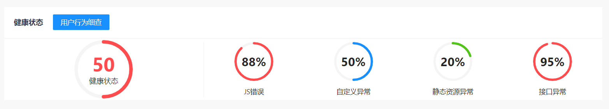
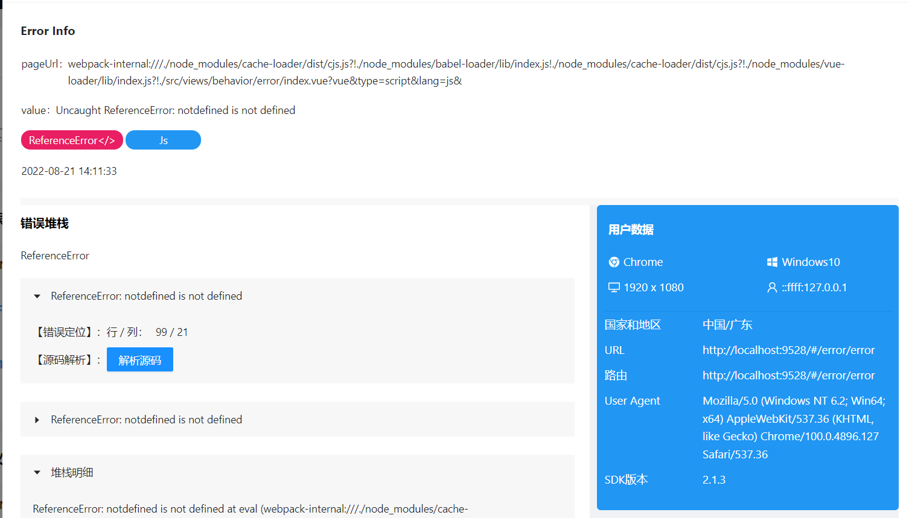
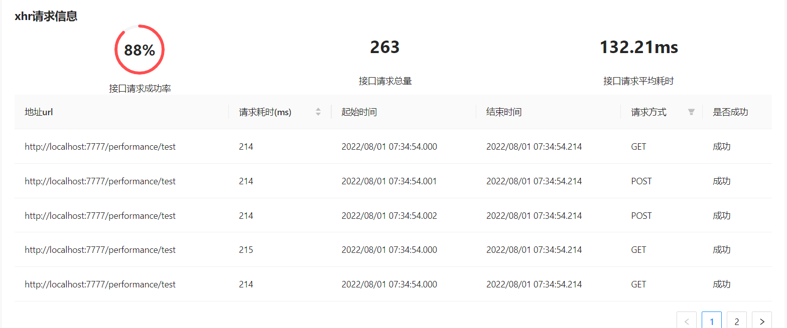
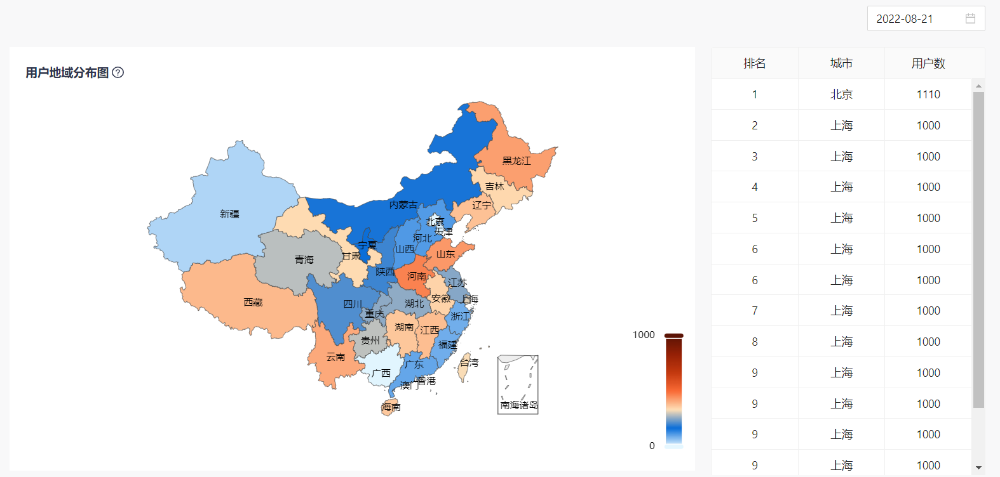
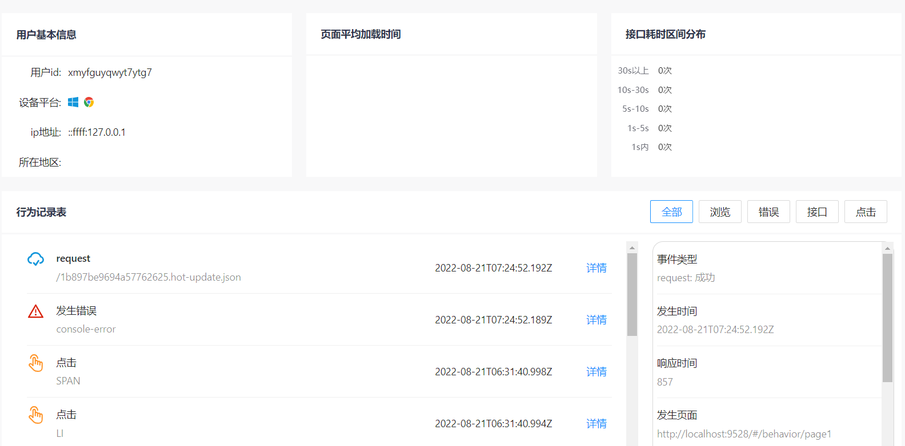

# femonitor-admin

前端监控系统：一个对 web 监控结果展示的系统

## 功能

- 概览: 查看监控项目总体的健康状态、流量数据、性能数据
  
- 错误监控：支持对 js 错误、请求错误、资源加载错误进行细节展示
  
- 性能监控: 支持对网络性能如 ajax 请求耗时和页面加载性能如 FP 等数据进行展示
  
- 流量监控：支持对用户的访问页面趋势和用户地域分布进行展示
  
- 用户行为追踪：支持对单个用户的所有行为进行细节追踪，包括触发的各种行为如点击、跳转、请求行为进行监测
  

## 准备

- 了解 node 和 git 开发环境
- 熟悉 react18 语法
- 熟悉 TypeScript 基本语法
- 熟悉 ES6+基本语法
- 熟悉 react-router-dom6 的基本使用
- 熟悉 redux 的基本使用
- 熟悉 Antd 组件库 ui 的使用

### 安装使用

- 安装依赖
  ```
  npm install
  ```
- 运行
  ```
  npm run start
  ```
- 登录使用
  ```
  test: 123456
  ```
- 打包上线
  ```
  npm run build
  ```
- git 提交规范
  ```
  npm run commit
  ```
